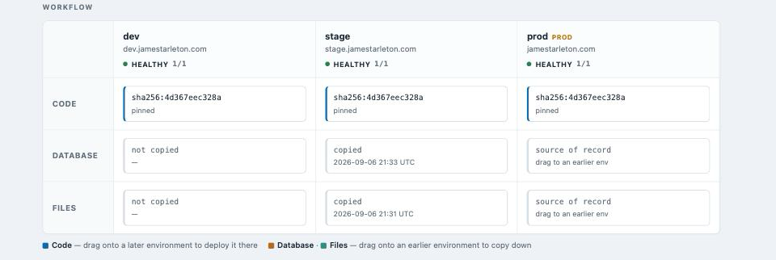

# Slipway

A deployment control plane for containerized Drupal on k3s.

The deployable unit is **code + database + files**, not just an image. Slipway
shows those three artifacts across dev, stage and prod as a grid, and every
operation is one artifact moving between two environments.

**Code promotes up. Data copies down.**

GitHub Actions builds and pushes an image, then stops. Slipway owns everything
stateful: it patches Deployments directly and runs each long operation as a
Kubernetes Job it creates and watches, so work survives a control-plane restart.

**[docs/manual.md](docs/manual.md)** is the full user manual — every CLI command
and how to drive the web UI.

## Status

Phase 4: `slipway console` runs drush (or any command) in an environment's
container, through the control plane and its audit log.

| Working | |
|---|---|
| `slipway grid` | what is running in every environment, named by release where CI recorded one |
| `slipway console -env NAME -- CMD` | run drush (or, with `-shell`, anything) in the running container |
| `slipway release -image REF -sha SHA -ref REF` | record a built image (what CI calls after a build) |
| `slipway releases` | list recorded releases |
| `slipway pin -env NAME` | rewrite a tag-pinned Deployment to the digest it already runs |
| `slipway adopt -env NAME` | strip leftover ArgoCD tracking so slipway is the namespace's sole owner |
| `slipway deploy -env NAME (-image REF \| -release REF)` | snapshot the database, patch, wait for the rollout, run update hooks |
| `slipway snapshot -env NAME` | dump the database to object storage and record it |
| `slipway snapshots -env NAME` / `restore -snapshot ID` | list snapshots, load one back |
| `slipway rollback -env NAME` | re-deploy the previous image; `-with-data` also restores its pre-deploy snapshot |
| `slipway copy-down -from prod -to stage` | files, database, sanitize — in order; `-skip-files` / `-skip-db` for one lane |
| `slipway resume` | re-attach to work left in flight |
| `slipway cancel -group NAME` | release a stalled sequence, cancelling the steps wedged behind a failure |
| `slipway history` | the operation log — what ran, against what, how it turned out |
| `slipway serve` | web UI over the same operations, plus a background reconcile loop |

Not built yet: the update-hook sequence's own tests against a live cluster; a
turnkey GitHub Actions workflow that calls `POST /api/releases` after a build
(the endpoint and token auth exist; the workflow YAML does not).

## The web UI

`slipway serve -addr :8080` runs two things in one process: an HTTP server that
renders the grid and drives operations, and a loop that reconciles in-flight
jobs every few seconds — so a sequence started from the CLI, or stranded by a
crash, finishes without a terminal held open.

The page lays the three artifacts out as an Acquia-style workflow matrix: **Code
/ Database / Files** down the side, environments across the top. Drag a Code cell
onto a later environment to deploy the digest it runs; drag a Database or Files
cell onto an earlier environment to copy it down. Each drop opens a confirm
dialog, then the operation runs. The Database and Files cells show when data was
last copied in, read back from job history — in the shot above, `stage` holds a
copy pulled from `prod`, `dev` has never been seeded, and `prod` is the source of
record. Anything the drag gestures don't cover — deploying an arbitrary image,
`-clean`, `-skip-config-import` — is under "Manual operations".

The Code cells name the running release where CI recorded one. Below the matrix:
a live log of the running operation, a list of recorded releases (each with a
"deploy to…" action), the database snapshots, an operation history of what ran
and how it turned out, and a job-steps table of every Kubernetes Job's state —
all pushed over the same event stream that drives the grid.

Every operation is the same `internal/ops` call the CLI makes; the server only
adds a single-flight guard (one operation at a time — copy-down scales a
Deployment to zero and a deploy landing mid-copy is the exact race to avoid) and
fans the operation's progress out to every open tab over Server-Sent Events. The
page is one embedded HTML file with no build step and no dependencies.

A sequence that failed midway shows up under "Stalled sequences" with the step
that blocked it; "Cancel sequence" (or `slipway cancel -group NAME`) marks the
wedged steps cancelled so `resume` and the reconcile loop stop reporting the
group as failed. The failed step itself is left as it is — nothing is retried or
cleaned up without someone deciding to.

## Layout

    internal/jobs      state machine and deterministic Job naming
    internal/store     SQLite control-plane state, with tiny forward migrations
    internal/k8s       cluster read, write, sweep (dynamic), and exec
    internal/engine    the reconcile loop
    internal/drupal    what each operation actually runs
    internal/grid      the "what is running where" read model, shared CLI/UI
    internal/ops       the operations, with nothing about how they are invoked
    internal/web       HTTP server, SSE, and the embedded page
    cmd/slipway        CLI

## Design notes

**The reconciler is a pure function.** `jobs.Decide(state, observation)` takes
the stored state and what the cluster reports, and returns a decision. It does
no I/O, which is why it can be tested exhaustively — `TestDecideIsTotal` walks
every state against every shape of observation.

**Job names are deterministic.** Resubmitting after a crash must collide with
the previous attempt rather than starting a second dump against the same
database. The name is written to SQLite *before* the Job is submitted, so a
crash in that gap leaves a recoverable record.

**Sequences stall where they fail.** `Runnable()` only offers a job whose
predecessors have all succeeded, which is what stops a sanitize running against
a database that never finished loading.

**Every deploy takes a snapshot first.** `deploy` dumps the database to object
storage and records the image it is replacing before it patches anything, so
`rollback` always has somewhere to go back to. A failed snapshot aborts the
deploy — deploying with no way back defeats the point. The dump-and-upload runs
as one Job with two containers sharing an `emptyDir`: mariadb writes a gzipped
dump into it, then aws-cli ships it out. Neither image carries the other's
tools, and the dump never lands on a PersistentVolume.

**Operations audit themselves.** Every `internal/ops` method records one audit
row on completion — action, target, actor (`cli` or `web`), and outcome —
regardless of which front end invoked it. `slipway history` and the web UI's
operation-history table read the same log.

**`console` execs into the running pod, not a Job.** The other operations run as
Kubernetes Jobs because they must outlive the control plane. An ad-hoc
`drush cache:rebuild` does not — it wants to be interactive-ish and immediate —
so `console` streams `remotecommand` straight into the serving container. It is
still audited like everything else.

**Slipway is the sole owner of the namespace.** `deploy` and `pin` patch
Deployments directly, with no GitOps controller to fight. `slipway adopt` makes
that literally true: it sweeps the environment's namespace with the dynamic
client and strips every `argocd.argoproj.io/*` annotation and instance label, so
a reinstalled ArgoCD cannot silently re-adopt what Slipway now manages. It is
idempotent — a namespace that was never under ArgoCD is left untouched.

**A release is recorded once, deployed by name.** CI `POST`s the built image and
its git provenance to `/api/releases` (bearer-token gated, the one endpoint
reachable from outside). `slipway deploy -release v2.1.0` resolves that to the
exact digest; the grid then shows `v2.1.0 · abc1234` instead of a bare hash, for
any environment whose running digest matches a recorded release. Schema changes
land through a tiny `migrate()` in `store.Open` — idempotent `ALTER TABLE`s run
after `schema.sql`, since `CREATE TABLE IF NOT EXISTS` will not evolve an
existing table.

## Assumptions

- InnoDB only, asserted at environment registration. This is what makes
  `mysqldump --single-transaction` correct with no locking and no scale-down.
- Composer-managed Drupal 11 with a `docroot/` layout.
- `settings.php`, `files` and `private` live on a shared `app` volume.
- One application, many environments. Single-tenant by design.

## Known issues in the environments this manages

- Backup CronJobs hardcode `jt-drupal` in their S3 destination and share one
  healthchecks.io URL, so any second environment overwrites production's backup
  and pings the switch that says production succeeded. Stage's are suspended as
  a stopgap; the destinations need to be per-environment.
- `jamestarleton-k8s-manifests` no longer syncs anything for the Drupal
  namespaces — ArgoCD was removed from them so Slipway could own the spec.
  Backups of the removed Applications are in `deploy/argocd-removed/`. The
  leftover `argocd.argoproj.io/*` metadata on the workloads has been cleared
  with `slipway adopt` (stale annotations on old ReplicaSets age out on their
  own).

## Development

    go test ./...
